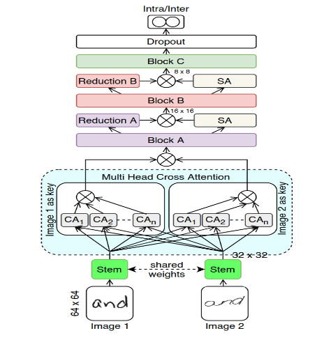

# Attention based Handwriting Verification using VGG16

The proposed system makes handwriting verification using VGG16 architecture ans soft attantion inaddition to cross attention to extract the most important features.

# Datasets

- Handwritten "AND": https://github.com/mshaikh2/HDL_Forensics
- CEDAR Signature: http://www.cedar.buffalo.edu/NIJ/data
